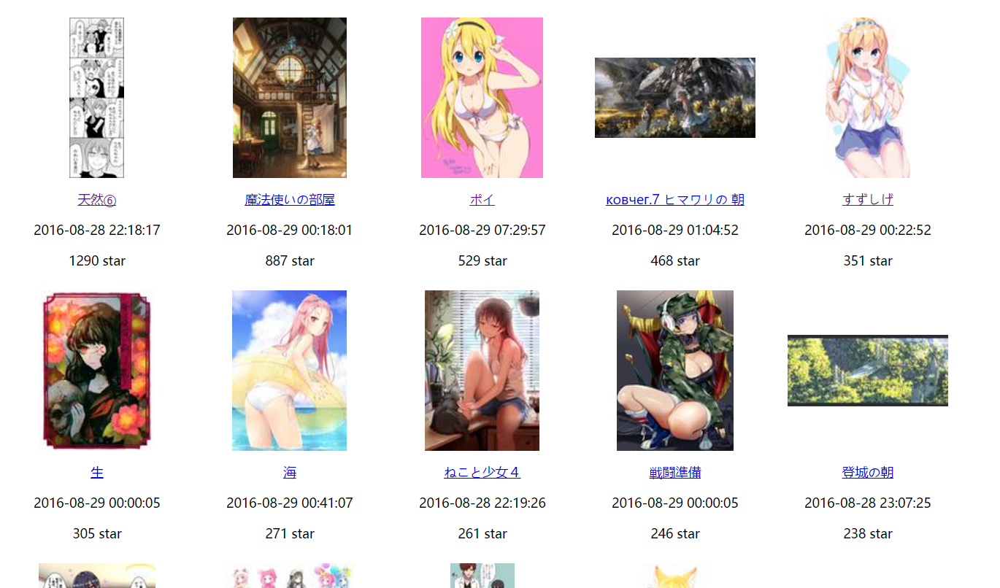

# Pixiv Image Search

***Author: Cathor***

***Time: 2016-08-27***

## About
* A small spider in scrapy, you can use it to search and download.
* You can use it to download all thumbnail and store their infomation locally and generate a html to display them order by their star
* You can choose a star number that any image with more star number than it will be downloaded

## Requirement
* Python 2.7
* scrapy
* Pillow

## Usage
1. Config crawler

    

2. Run scrapy with params:
    
    `scrapy crawl pixiv -a keyword="战舰少女" -a oneof=Z1##Z16##Z31 -a exclude=空想##沃克兰 -save_thumbs=False -a save_star=200 -a save_dir=destroyer`
    
    ### Explain:

    * keyword: The tag you want to search, if you want to use several tags, please use ***##*** to connect them, like `女の子##花`
    * oneof: Search for pics containing one of these tags(Optional)
    * exclude: Search for pics containing none of these tags(Optional)
    * max_page: how many pages the spider will crwal
    * save_star: image with more star number than this will be downloaded
    * save_thumbs: whether to download thumbnail and infomation
    * save_dir: The folder you want to save the big images(default 'big'), in the dir you set in settings.py

    Then big images will be downloaded into `the path you defined(default is the root path of project)/origin/${save_dir}`
    Images is named in this format: `star_illustrateID_pagenumber.extension`

3. If you have saved thumbnails, you can generate a preview page in order of star by call:

    `python generate.py`

    A html file will be created in the folder you download images and it named `view.html`. This page is ugly, and only shows you images.

    ### The ugly page:

    