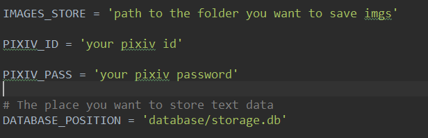

# Pixiv Image Search

***Author: Cathor***

***Time: 2016-08-27***

## About
* A small spider in scrapy, you can use it to search and download.
* You can use it to download all thumbnail and store their infomation locally and generate a html to display them order by their star
* You can choose a star number that any image with more star number than it will be downloaded

## Requirement
* scrapy

## Usage
1. Config crawler

    

2. Run scrapy with params:
    
    `scrapy crawl pixiv -a keyword=战舰少女 -a max_page=200 -a save_star=400 -a save_thumbs=False`
    
    ### Explain:

    * keyword: 
    * max_page: how many pages the spider will crwal
    * save_star: image with more star number than this will be downloaded
    * save_thumbs: whether to download thumbnail and infomation

